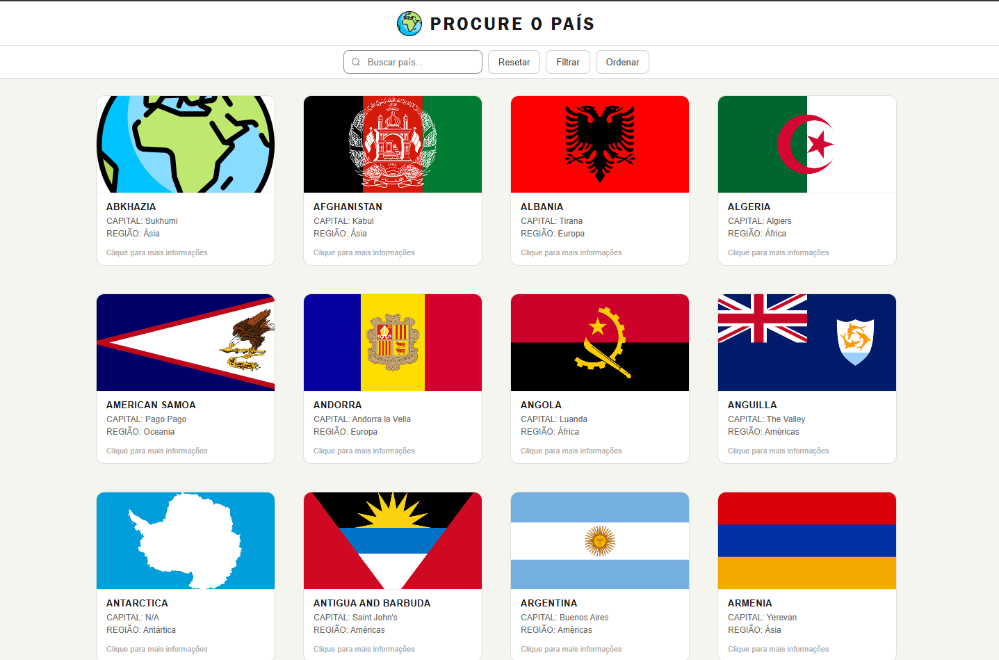
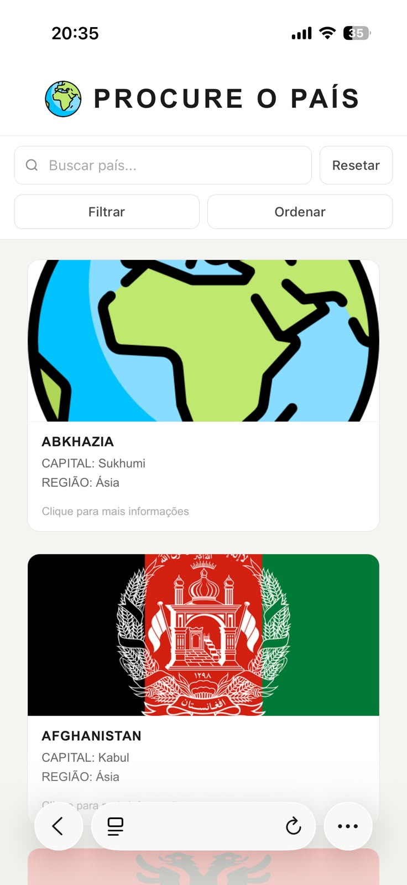

# 🌍 Procure o País

> Uma aplicação web para explorar países e territórios do mundo — agora reconstruída em Angular, mantendo a ideia original do projeto: simples, direta e funcional.

---

> [!NOTE]
> Este projeto começou como uma aplicação feita apenas com **HTML, CSS e JavaScript puro**, consumindo dados da API RestCountries.
>
> Com o tempo, mudanças na API e a necessidade de melhorar estabilidade, desempenho e independência de serviços externos levaram à migração dos dados para um arquivo JSON local.
>
> Depois disso, o projeto foi reestruturado em **Angular**, preservando a proposta visual e funcional original, mas ganhando uma arquitetura mais organizada, componentizada e preparada para evolução.

---

## Sobre

O **Procure o País** nasceu com uma proposta simples: permitir que o usuário encontre países, filtre resultados, organize informações e consulte detalhes de forma rápida.

A primeira versão foi construída sem frameworks, apenas com HTML, CSS e JavaScript puro. Essa escolha fez sentido no início do projeto, porque o foco era praticar manipulação de DOM, consumo de dados, filtros, ordenação e construção de interface do zero.

Na versão atual, o projeto foi migrado para **Angular**, mantendo a essência da aplicação original, mas reorganizando sua estrutura em componentes, rotas, services e arquivos reutilizáveis.

A aplicação utiliza um arquivo JSON local com dados baseados na RestCountries, garantindo funcionamento consistente sem depender de requisições externas em produção.

---

## Preview

<div align="center">
  
  
</div>

---

## Como executar localmente

Clone o repositório:

```bash
git clone https://github.com/andrxls/RestCountries-API.git
```

Acesse a pasta do projeto:

```bash
cd RestCountries-API
```

Instale as dependências:

```bash
npm ci
```

Inicie o servidor de desenvolvimento:

```bash
npm start
```

Depois acesse:

```text
http://localhost:4200
```

---

## Funcionalidades

- 🔍 **Busca em tempo real**
  - Atualiza a lista conforme o usuário digita
  - Considera nomes em inglês, português e nomes alternativos
  - Ignora acentos durante a comparação

- 🗂️ **Filtros por:**
  - Região
  - Sub-região
  - Faixa de população

- 🔃 **Ordenação por:**
  - Nome, de A a Z
  - Nome, de Z a A
  - População crescente
  - População decrescente
  - Área crescente
  - Área decrescente

- 🏷️ **Filtro e ordenação ativos**
  - Os botões principais exibem o filtro ou ordenação em uso

- 🌓 **Modo claro e escuro**
  - Permite alternar visualmente entre light mode e dark mode
  - A interface adapta cores de fundo, textos, botões, cards, menus, painel mobile e campo de busca
  - O botão de tema usa ícone de sol/lua para indicar a troca visual

- 📄 **Página de detalhes**
  - Ao clicar em um país, o usuário acessa uma página com informações adicionais

- 🗺️ **Mapa interativo**
  - A página de detalhes exibe a localização do país com Leaflet e OpenStreetMap

- ♻️ **Botão Resetar**
  - Limpa busca, filtros e ordenação de uma vez

- 📱 **Layout responsivo**
  - A interface foi adaptada para desktop, tablet e celular

---

## Tema claro e escuro

A aplicação conta com alternância entre **modo claro** e **modo escuro**, permitindo uma experiência visual mais confortável em diferentes ambientes.

O tema foi implementado com variáveis CSS, facilitando a troca de cores entre os modos sem duplicar toda a estrutura visual da interface.

O dark mode ajusta os principais elementos da aplicação:

- Fundo geral da página
- Barra de navegação
- Campo de busca
- Botões
- Menus dropdown
- Submenus
- Cards dos países
- Página de detalhes
- Painéis de filtro e ordenação no mobile/tablet

---

## Responsividade

A versão mobile recebeu uma adaptação própria para melhorar a experiência em telas menores.

No desktop, a navegação mantém os menus dropdown, seguindo a proposta visual original.

Em tablets e celulares, a interface foi reorganizada:

- O título fica centralizado no topo
- A barra de busca ocupa mais espaço horizontal
- O botão de reset fica ao lado da busca
- Os botões de filtro e ordenação aparecem lado a lado
- Filtros e ordenações são exibidos em painéis próprios, evitando problemas com menus baseados em hover

Essa mudança tornou a experiência em dispositivos móveis mais clara e confortável para toque, além de evitar que submenus fiquem cortados em larguras intermediárias.

---

## Tecnologias


---

## Estrutura do projeto

```text
src/
  app/
    core/
      models/
        country.ts
      services/
        countries.ts
        theme.ts
      utils/
        country-translations.ts

    pages/
      countries-list/
      country-details/

    shared/
      header/

    app.config.ts
    app.routes.ts

public/
  assets/
    data/
      countries.json
    preview/
      desktop.png
      mobile.png
```

---

## Dados

Os dados utilizados pelo projeto são baseados na **RestCountries**.

O arquivo local contém informações como:

- Nome comum
- Nome oficial
- Traduções
- Bandeira
- Capital
- Região
- Sub-região
- População
- Área
- Coordenadas geográficas
- Idiomas
- Moedas

Atualmente, os dados são carregados localmente a partir de:

```text
public/assets/data/countries.json
```

Essa abordagem remove a dependência direta de APIs externas em produção e garante um funcionamento mais estável, especialmente em hospedagens estáticas.

---

## Histórico do projeto

Este projeto passou por três fases principais:

### 1. Versão inicial

- HTML, CSS e JavaScript puro
- Consumo direto da API RestCountries
- Foco em praticar DOM, eventos, filtros e ordenação

### 2. Versão com JSON local

- Dados migrados para um arquivo local
- Menor dependência de serviços externos
- Mais estabilidade para deploy estático

### 3. Versão Angular

- Reestruturação em componentes
- Uso de Angular Router
- Criação de service para carregamento dos países
- Separação entre listagem e página de detalhes
- Integração com Leaflet
- Melhor organização do código
- Layout responsivo para desktop, tablet e celular
- Implementação de modo claro e escuro

---

## Status

Projeto finalizado em sua versão Angular.

Funcionalidades principais implementadas:

- Listagem de países
- Busca em tempo real
- Filtros por região, sub-região e população
- Ordenação por nome, população e área
- Alternância entre modo claro e escuro
- Carregamento progressivo dos cards
- Página de detalhes
- Mapa com Leaflet
- Layout responsivo para desktop, tablet e celular
